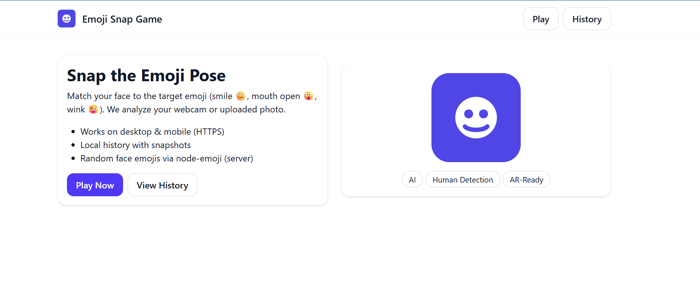

# Emoji Snap Game 🎯🙂😮😜

Match your facial expression to the target emoji. Built with **Next.js + MediaPipe Face Landmarker**. Saves a local **History** with your snapshots. Includes **success/fail sounds**.

## ✨ Features
- 🧑‍🎤 **Face Detection** with `face-api.js` (landmarks + expressions)
- 😀 **Emoji Targets** randomly generated with `node-emoji`
- 📸 **Camera or Upload**: play live with your webcam, or upload an image
- ⏱️ **Countdown Timer** before each snap
- ✅ **Scoring**: checks if you matched the target pose
- 🗂️ **History** saved in LocalStorage (with clear/reset option)
- 🐳 **Dockerized** for easy deploy

---

## ☁️ Demo
You can try this game from this web host:  https://emoji-snap-game.onrender.com/

---


## 📷 Screenshot 



## 🛠️ Installation (Local Dev)

### 1. Clone repo
```bash
git clone https://github.com/yourname/emoji-snap-game.git
cd emoji-snap-game
```

### 2. Install deps
```bash
npm install
```

### 3. Run dev server
```bash
npm run dev
```
App runs at 👉 [http://localhost:3000](http://localhost:3000)

---
## 🧑‍💻 Development Notes

### LocalStorage History
- Keeps **up to 500 snaps**
- If exceeded → history auto-flushes
- Clear all from **History page → Clear button**

### Expressions Detected
Face-API provides 7 classes:
```
neutral, happy, sad, angry, fearful, disgusted, surprised
```

### Emoji Targets
Mapped into 7 categories:
- Smile
- Mouth Open
- Wink (Left/Right)
- Eyes Closed
- Frown
- Raised Brow

---


## 🐳 Run with Docker

```bash
docker-compose up --build
```

- Frontend → `http://localhost:3000`


## 📜 License
MIT © 2025 Phumiapiluk Pimsen